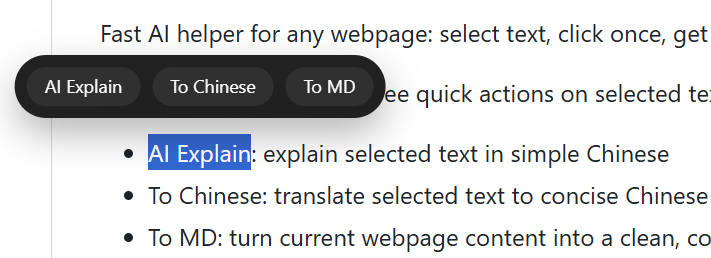

# Chrome Plug-in to Quick Translate To Markdown for Chrome

English | [中文](README.zh-CN.md)

Fast AI helper for any webpage: select text, click once, get instant streaming output.

This extension provides three quick actions on selected text and page content:

- AI Explain: explain selected text in simple Chinese
- To Chinese: translate selected text to concise Chinese
- To MD: turn current webpage content into a clean, compact Markdown summary

Built for reading, research, and quick note-taking directly in browser.

## Why This Extension

- No tab switching: run explain, translate, and markdown conversion in-page
- Streaming response: see generated content as it arrives
- Lightweight workflow: selection toolbar plus floating result panel
- Copy-friendly output: Markdown result is easy to copy into docs, wiki, or notes

## Quick Install in 3 Steps

1. Open Chrome and go to chrome://extensions/
2. Enable Developer mode
3. Click Load unpacked and select the chorme_marker_AI folder

## First-Time Setup

1. Open extension Details
2. Open Extension options
3. Paste your Kimi API Key and click Save
4. Optional: click Test to verify authentication

## How To Use

1. Open any webpage
2. Select text to show the floating toolbar
3. Click AI Explain, To Chinese, or To MD
4. Read streaming result in the result card and copy content when needed

## Feature Highlights

- Floating action toolbar for selected text
- Streaming generation from Kimi API
- Model auto-detection with fallback priority
- Error feedback in result card when request fails
- API key storage via extension options

## Project Structure

- [manifest.json](manifest.json): Chrome extension manifest (MV3)
- [background.js](background.js): Kimi API calls, model resolution, streaming pipeline
- [content.js](content.js): toolbar interactions, action dispatch, result rendering
- [content.css](content.css): toolbar and result card styles
- [options.html](options.html): options UI
- [options.js](options.js): API key save and test logic

## API and Permissions

- API endpoint: https://api.moonshot.cn/v1/chat/completions
- Model list endpoint: https://api.moonshot.cn/v1/models
- Permissions: storage
- Host permissions: https://api.moonshot.cn/*
- Content script match: all urls

## Search Keywords for GitHub

chrome extension, kimi, moonshot, ai explain, translate to chinese, markdown generator, webpage to markdown, browser productivity, mv3, selection toolbar, streaming ai output

## Chinese Search Keywords

Chrome 插件, Kimi 插件, 网页翻译, 网页解释, 网页转 Markdown, 划词工具, 浏览器 AI 助手, 流式输出, Moonshot API, MV3 扩展

## License

MIT License. See [LICENSE](LICENSE).
